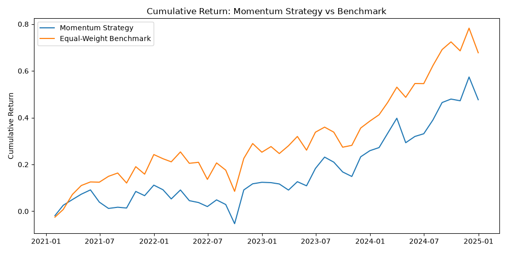

# Quantitative Equity Strategy Research & Backtesting Framework

*Does buying recent winners actually beat just holding everything? I built this to find out, properly.*

> **Status:** This is a living document. It reflects what I know as of Version 0.3 (momentum, fully tested) plus in-progress work on Version 0.4 (adding a value factor). The momentum conclusions below are final for that factor; the value factor work is still being built out.

---

## What this project is

I wanted to move from "I understand markets and financial statements" toward actually being able to build and test an investment idea in code. This project is that attempt: a small but real research pipeline that pulls historical stock data, builds factor signals, constructs portfolios from them, and backtests whether they would have actually worked.

I'm not trying to prove any strategy is a winner. I'm trying to test ideas honestly and report whatever the data actually shows — including if the answer is "no, it didn't work here."

## The question I'm asking

If you rank a group of stocks by how well they've recently performed, and buy the top performers, does that actually beat just holding all of them? And separately: does ranking stocks by how cheap they are relative to their fundamentals do any better?

## Why I expected momentum might work

Momentum is one of the better-documented patterns in finance research — stocks that have been going up tend to keep going up for a while longer, at least over 3-12 month horizons. I built my signal using the standard "12-1" version of this: I measure the return over the past 12 months, but I deliberately drop the most recent month. That's because there's a separate, well-known effect (short-term reversal) where stocks that just popped tend to give some of it back over the next few weeks. Including that last month would mix two opposing effects together, so I left it out.

## How I built the momentum strategy

- **The stocks I used:** 17 large, liquid companies spread across different sectors (tech, financials, healthcare, energy, industrials, etc.). I picked them for size and liquidity, not because I already knew they'd do well — that would have defeated the whole point.
- **The data:** Daily adjusted closing prices from Yahoo Finance, 2020 through 2024, pulled with `yfinance` and stored in a local SQLite database.
- **The signal:** 12-month return, skipping the most recent month, calculated at the end of each month.
- **Rebalancing:** Every month, I re-rank all 17 stocks and rebuild the portfolio from scratch.
- **On the look-ahead bias question:** because I already skip the most recent month when computing momentum, the signal for any given month is fully known before that month's return happens — so I'm not accidentally using future information to make past decisions.

## How the momentum portfolio works

Each month, I take the 5 stocks with the highest momentum score and hold them in equal amounts (20% each). I kept it simple on purpose — no volatility weighting, no optimization — because I wanted to isolate one question: does the *ranking itself* add value? Fancier weighting can come later, but only after I know the basic signal is worth building on.

My benchmark is just holding all 17 stocks equally, all the time, with no picking involved. That's the "do nothing clever" comparison.

## What actually happened with momentum

| Metric | Momentum Strategy | Just Holding All 17 |
|---|---|---|
| Period | 2021–2024 | 2021–2024 |
| Total return | 47.7% | 67.7% |
| Annualized return | 10.2% | 13.8% |
| Annualized volatility | 14.8% | 14.6% |
| Sharpe ratio | 0.56 | 0.81 |
| Max drawdown | -14.8% | -13.4% |



## What I make of the momentum result

Honestly — the strategy lost on every single measure. Not just lower return, but a worse Sharpe ratio and a worse drawdown too. And the thing that stands out to me: the volatility of both portfolios was almost identical (14.8% vs 14.6%). That rules out the easy excuse of "well, at least it took less risk" — it didn't. It took basically the same risk and delivered less.

My best guess for why: by only holding 5 stocks instead of 17, I gave up some diversification benefit, and it doesn't look like the momentum signal made up for that loss here. I want to be careful not to overstate this, though — this is one universe, one 4-year window, and one specific way of building the portfolio. It's a real result, but not a sweeping one.

## Where this falls short (and I want to be upfront about it)

- **Only 17 stocks.** That's a small, hand-picked group, not the actual S&P 500. A bigger universe might behave differently.
- **One time period.** 2021-2024 includes 2022, which was a genuinely rough year for momentum strategies generally. I haven't tested other periods yet.
- **No trading costs.** Rebalancing every month in real life isn't free. I haven't modeled that yet on either side, so this comparison is a bit optimistic for both.
- **Risk-free rate is a flat guess.** I used a constant 2% for the Sharpe ratio instead of pulling actual historical rates.
- **Just momentum, on its own, so far.** See below for what I'm adding next.

---

## In progress: adding a Value factor

Momentum losing on every metric made me want to test something that behaves differently. Value and momentum are known in finance research to have a negative correlation — value tends to do well precisely when momentum struggles. So the next real question is whether a value-based approach would have done better over the same period, and eventually whether combining the two helps.

**Why value needs different data than momentum.** Momentum only needs prices, which `yfinance` handles well. Value needs actual company fundamentals — book value, specifically, for a Price-to-Book ratio. I wanted this to come from primary, official data rather than a paid API, so I built a small module that pulls directly from the SEC's EDGAR system — the same regulatory filings (10-Ks, 10-Qs) every public company is legally required to submit, exposed as free, structured data with no signup or API key required.

**What this actually involves:** EDGAR doesn't hand you a pre-calculated P/B ratio. It gives you the raw ingredients — stockholders' equity and shares outstanding, each tied to the exact date it was filed — and I compute book value per share myself: `equity / shares outstanding`. That means I know exactly when each figure was actually known publicly, which matters for avoiding the same look-ahead bias problem I was careful about with momentum.

### The mess of real filing data

Fetching this cleanly across all 17 tickers was genuinely harder than fetching prices, for reasons worth documenting rather than hiding:

- **Different companies tag the same concept differently.** Apple and Microsoft report shares outstanding under one standard XBRL tag; other companies use a different tag on a different reporting page (the "cover page" versus the balance sheet), or a variant for companies with partially-owned subsidiaries. I found this by directly inspecting each company's raw filing data rather than guessing, and built a small system that tries multiple known tag variants and combines them.
- **Filing dates don't line up perfectly.** A company's equity figure and its share count are sometimes filed a few weeks apart within the same reporting period. An exact-date match would silently miss these pairs, so I match dates within a 45-day window instead.
- **At least one outright bad filing exists in the wild.** Coca-Cola's data included a single row reporting exactly 0 shares outstanding in 2009 — clearly a filing error, since real values before and after are in the billions. I filter out any non-positive share count as invalid.

### Current data coverage, and why it varies

After fixing the issues above, here's what I actually have (book value data points per ticker, 2020–2024):

| Ticker | Data Points | Notes |
|---|---|---|
| AAPL, MSFT, JPM, HD, CAT, PG | 68–74 | Strong, consistent coverage |
| UNH, WMT, KO, LMT, RTX, NEE | 50–72 | Good coverage |
| JNJ, LIN | 34–61 | Moderate coverage |
| DIS | 27 | Constrained — likely a date-alignment gap between otherwise-healthy equity and shares data, not yet fully root-caused |
| XOM | 6 | **Confirmed cause:** the SEC only made this specific disclosure tag mandatory for large filers starting with fiscal periods ending June 15, 2019 — before that, it was voluntary and often just plain text, not structured data. This isn't a data quality issue specific to Exxon; it's a regulatory rollout timing issue that affects any company's older filings. |
| V | 2 | **Likely cause, not fully confirmed:** Visa has a multi-class share structure (Class A/B/C common stock) that doesn't map cleanly onto the single standard tag most companies use for a simple total share count. |

Where coverage is genuinely sparse (V, XOM), I plan to forward-fill book value between known data points — using the last reported figure until a new one arrives. This is standard, defensible practice for fundamental data, which only updates quarterly at most, unlike prices.

### What's left to finish the Value factor

1. Forward-fill the sparse tickers
2. Merge book value with market price to compute actual Price-to-Book ratios
3. Store fundamentals in the database properly
4. Rank stocks by value (low P/B is attractive — the opposite direction from momentum) and backtest it, the same rigorous way I tested momentum

## The dashboard

Not built yet. I want the results to actually be worth putting on a dashboard before I build one.

## What I used

Python (pandas, NumPy, matplotlib, yfinance, requests), SQLite, the SEC's public EDGAR API, Git/GitHub, VS Code.

## How the project is laid out

```
quant-equity-research/
├── database/            # SQLite database (generated, not committed)
├── src/
│   ├── data_loader.py   # pulls price data from Yahoo Finance
│   ├── database.py      # saves/reads from SQLite
│   ├── factors.py       # builds the momentum signal
│   ├── fundamentals.py  # pulls and cleans SEC EDGAR fundamentals for the value factor
│   ├── portfolio.py     # ranks stocks, builds the portfolio
│   ├── backtest.py      # simulates returns, compares vs benchmark
│   └── risk.py          # Sharpe ratio, volatility, drawdown
├── results/             # saved charts
├── run_data_pipeline.py # fetches + stores price data end to end
├── check_data.py        # sanity-checks the stored data
└── requirements.txt
```

## What's next

- **Right now:** finishing the value factor (forward-fill, P/B calculation, ranking, backtest) and comparing it honestly against the momentum result above.
- **After that:** testing whether combining momentum and value does better than either alone.
- **Then:** stress-testing properly — trading costs, a bigger universe, different rebalancing frequencies, testing on a period I haven't looked at yet.
- **Eventually:** a real interactive dashboard, once there's a result worth showing off.

---

*Everything above reflects what I know as of this update. The momentum findings are complete and specific to the stocks, time period, and method I used. The value factor is still in progress — treat that section as a work log, not a finished result.*
